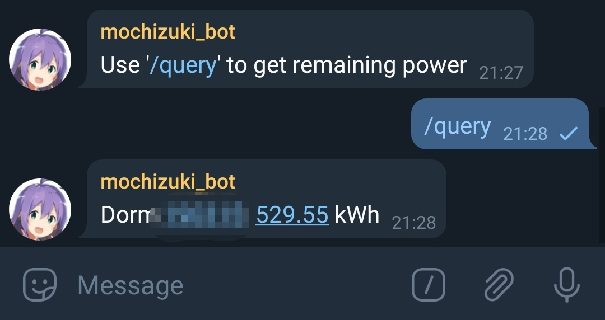
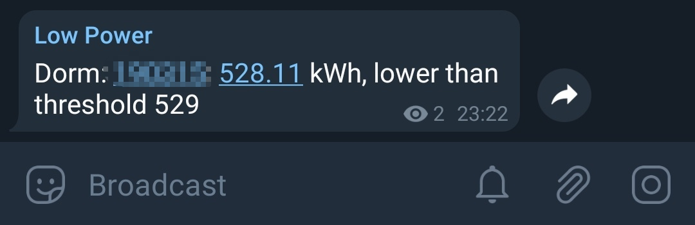
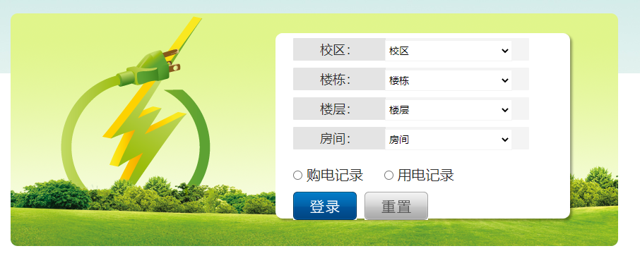
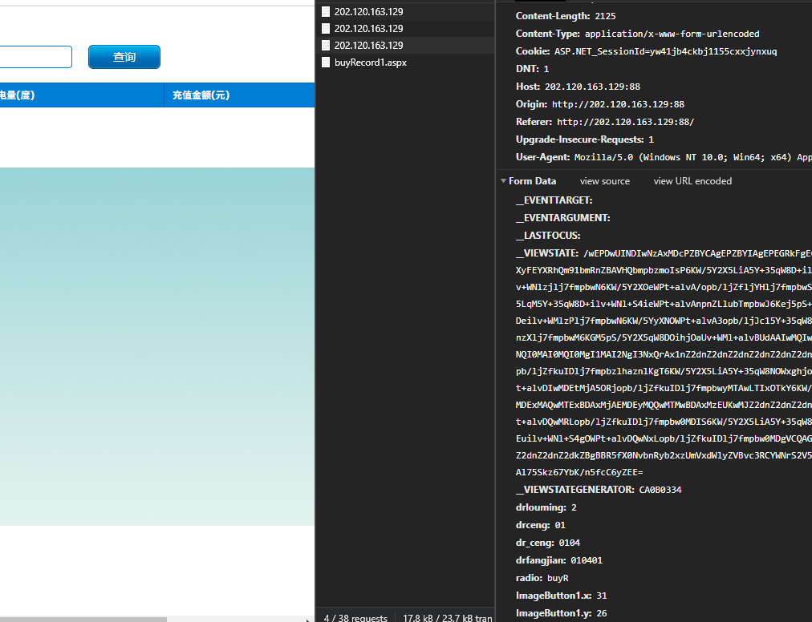

# Mochizuki

同济大学能源管理中心电费自动查询 telegram bot

Manually/auto query and send alarms to channel when the power gets below your threshold.




## Installation

### From RubyGems

```
gem install mochizuki
```

### Using docker

**Recommended**

```bash
docker pull darkkowalski/mochizuki
```

```bash
docker run --name mochizuki \
           --restart=always \
           -v /path/to/mochizuki.conf:/app/mochizuki.conf \
           -d -it darkkowalski/mochizuki
```

## Configuration

Place a `mochizuki.conf` in your directory and run `mochizuki`

```ruby
Mochizuki.configure do |config|
  config.bot_token = 'your_bot_token'
  config.channel = '@your_channel'
  config.query_interval = '300s'
  config.alarm_threshold = '60' # kWh

  config.campus = '1'
  config.building = '1'
  config.floor = '1'
  config.dorm = '1'
end
```

**How to get the last four attributes**

Go to [同济大学能源管理中心](http://202.120.163.129:88) and fill the form



Open your dev tools and look at the bottom on the right



Those shitty words mean

```
drlouming  ->  campus
drceng     ->  building
dr_ceng    ->  floor
drfangjian ->  dorm
```

## Known issues

### Telegram returned 403

```
Telegram API has returned the error. (ok: "false", error_code: "403", description: "Forbidden: bot was kicked from the supergroup chat") (Telegram::Bot::Exceptions::ResponseError)
```

This is a telegram internal issue, not this gem's.

See [Stack Overflow](https://stackoverflow.com/questions/34040277/telegram-bot-api-errors-codes-integrating-groups-and-channels)
